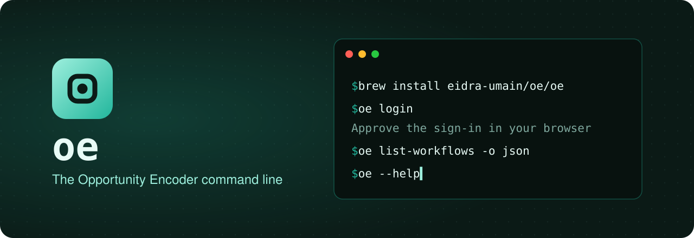

<p align="center">
  
</p>

# oe

`oe` is the command line for [Opportunity Encoder](https://opportunity-encoder-production.up.railway.app). Read and change your Workflows, Modules, Visualizations and Blueprints from a terminal, yourself or through your coding agent. It acts as you, and can reach only what you can.

## Install

```bash
brew install eidra-umain/oe/oe
```

Works on macOS and Linux. Otherwise, download `oe` from the [latest release](https://github.com/eidra-umain/homebrew-oe/releases/latest) and put it on your `PATH`.

## Sign in

```bash
oe login
```

Your browser opens OE: sign in if asked, then approve. You need an OE account.

- `oe` stays signed in on its own, apart from your browser, and renews itself for up to 90 days.
- See or revoke its sign-in in OE, under **Settings → Personal Access Tokens**.
- No browser, such as on a CI runner? Make a Personal Access Token there and set `OE_TOKEN=oe_pat_…` instead.

## Use

```bash
oe --help                    # every command
oe list-workflows -o json    # your Workflows
```

| Setting           | What it does                                        |
| ----------------- | --------------------------------------------------- |
| `OE_TOKEN`        | Use a Personal Access Token instead of signing in   |
| `OE_URL`          | Talk to another OE, such as a local server          |
| `OE_MACHINE_NAME` | Name this machine's sign-in; its host name if unset |

## Update and remove

```bash
brew update && brew upgrade oe
oe logout          # end this machine's sign-in
brew uninstall oe
```

`brew update` comes first because Homebrew refreshes a tap on its own at most once a day, and `oe` can be released several times a day.

---

This is a [Homebrew tap](https://docs.brew.sh/Taps). OE's release pipeline publishes each tested `oe` here; please don't edit `Formula/oe.rb` by hand.

Copyright © 2026 Dawid Dahl and Prabhat Ramesh. All rights reserved.
